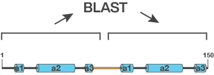
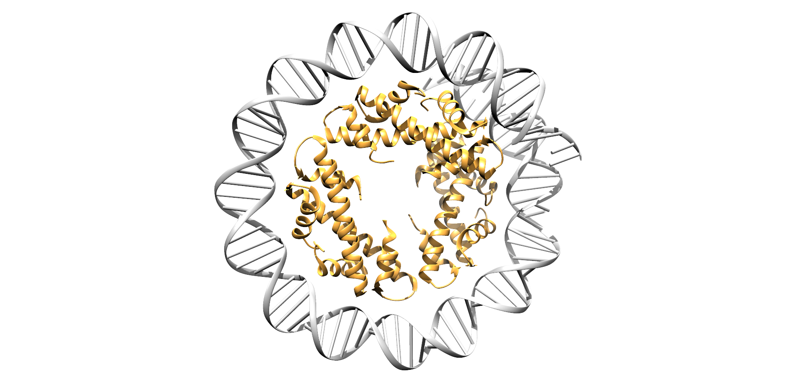
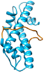

# Half BLAST
## Abstract
This program is used to determine if a protein is a doublet (i.e. composed of a duplication of a protein fused to itself), by comparing the first half of the protein to the second using a BLAST algorithm. 



## Backgroud
Many proteins act in conjunction with multiple copies of themselves. This is known as multimerization. When a protein works as a complex of two it is called dimerization. Although many proteins work as dimers, the ones I am insterested in are histones from the domain Archaea. These proteins are used to compacted DNA by forming dimers then binding to and bending DNA, these dimers can then form higher order complexes (usually in multiples of 6, it seems) to form nucleosomes. 




Halophilic archaea encode histones that are expressed as an obligate dimer, two histones connected by a linker.



## Goals
1. Identify which histones are doublets.
2. Compare percentages of doublet proteins in halophilic organisms to non-halophilic organisms to see if doublet proteins are an adaptation to high salt environments.

## How it works
Input = Multifasta file
Output = File with results of each protein's first half BLASTed against its second half.
1. Parse multifasta file.

The first section of code imports a multifasta file that looks like this:

```
>gi|1233091460|ref|WP_094495612.1| MULTISPECIES: aldolase [Halorubrum]
MSVELPFAPVDGIIRRNAGELRVSADAAEELARRIQSHGAELAVDAAEHATADGRKTLMAADFGVEQVVGREDLTLPVAPIDRIARLRIDDRYRVGVDARVALADILEDYADNVASAAATLARHADRRTVQAEDIETYFALFE
>gi|1224904600|ref|WP_092920574.1| MULTISPECIES: aldolase [Halorubrum]
MSVELPFAPVDGIIRRNAGELRVSADAAEELARRIQSHGAELAIDAAEQATADGRKTLMAADFGVEQVVSREDLTLPVAPIDRIARLRIDDRYRVGVDARVALADILEDYADNVASAAATLARHADRRTVQAEDIETYFALFE
>gi|1390393513|gb|PWI49724.1| histone [Candidatus Heimdallarchaeota archaeon B3_Heim]
MVEIPNSAIDRIIRKSGANRVSKSAIHVLQKELEDYGEKIASLGTEIASHAGKKTVEGEDITLAIHKVKFLL
>gi|1390392811|gb|PWI49027.1| histone [Candidatus Heimdallarchaeota archaeon B3_Heim]
MAGFASARIEKLIRTAGARRVSAKAISRLNEVLTEYSMDLAKYAVEIARHSGRKTVKENDVKLAADK
```

It creates a nested array that includes gene name, sequence, and sequence length.

```
[['>gi|445570158|gb|ELY24724.1|_histone-like_protein_Halogeometricum_borinquense_DSM_11551', 'MSVELPFAPVDTIIRRNAGSLRVSADAAEELARRIQRHGSELAIDAAERAREDGRKTLMAEDFDVEQVVSRAELELPVAPVDRIARLRIDDRYRVSMDARIALADILEDYADNVADAAAKLARHADRRTIQAEDIETYFALFE', 217], ['>gi|399240031|gb|EJN60957.1|_histone-like_protein_Halogranum_salarium_B-1', 'MGMSVELPFAPVDTIIRRNAGNLRVSADAAEELARRIQAHGADLAKDAAVCASDDGRKTLMAQDFGVEQVVERADLELPIAPIDRIARLDIDDRYRVSMSARIALADILEDYADNVASAAAKLAHHADRRTIQAEDIETYFSLFE', 217], ['>gi|320550523|gb|EFW92175.1|_Transcription_factor_CBF/NF-Y/histone_domain_protein_Haladaptatus_paucihalophilus_DX253', 'MSVELPFAPVDTIIRRKAGDLRVSADAAEELARRIQIHGAELAVDAAKRATKDGRKTLMAEDFGVQQVIDKDELVLPVAPVDRIARLDIDDDYRVSMDARVALADILEDYANNVAAAASILAHHADRRTVKAEDIETYFRLFE', 217]]
```
2. Cut sequence in half.

The script then takes each sequence, cuts it in half and then writes the first half to a 'database' file and the second half to a 'query' file.

3. BLAST.

It then uses a subprocess.call() function to exit the python script and access the preloaded BLAST module on the Fiji compution cluster.

4. Write to file.

The results are then written to an 'output' file that includes info about each BLAST.

```
Half Blast of: halo_sal_genome.fa Contains: 2605 proteins													
"query acc.ver, protein length, % identity, alignment length, mismatches, gap opens, q. start, q. end, s. start, s. end, evalue, bit score"													
AAC82793.1	772	36.471	170	93	5	18	182	24	183	5.40E-25	92		0.220207254
AAC82810.1	382	37.5	56	29	2	12	67	24	73	7.92E-04	24.3		0.146596859
AAC82814.1	917	25.301	83	61	1	121	202	214	296	
```

# Developement
There are much better ways to do this.

1. The major change that needs to happen is for the BLAST module to be converted to an internal python-based BLAST module (this is a good place to start I think https://biopython-tutorial.readthedocs.io/en/latest/notebooks/07%20-%20Blast.html#Running-BLAST-locally). The current method is very slow because:
    1. It writes two files for inputs to the BLAST.
    2. Loops out of the python script to run a bash command.
    3. Accumulates all of these intermediate files in the working directory.
2. Don't append each new BLAST to file as it happens, simply wrtie one file at end.
3. We also don't need to return every result, we could just output the ones that are actual doublets, this will require us to define a 'doublet threshold' that would likely be based on the % identity or evalue (this will take some testing to figure out).
4. We also need to make this into modular functions.
5. The multifasta importing bit of this code seems to work pretty well, although I'm sure there are better ways to do it too.
6. We should think about how we want to output this data as well, because the output now is super clunky.